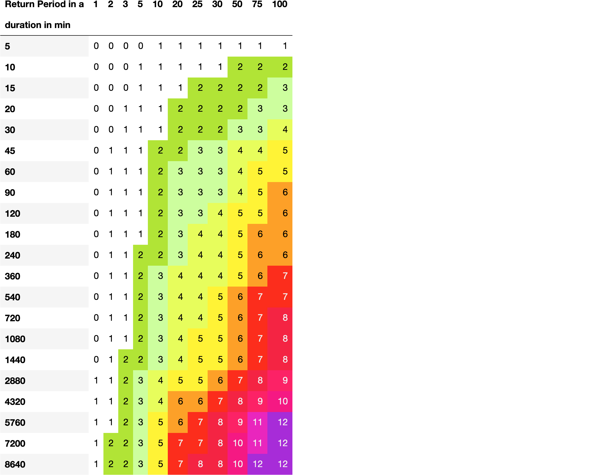
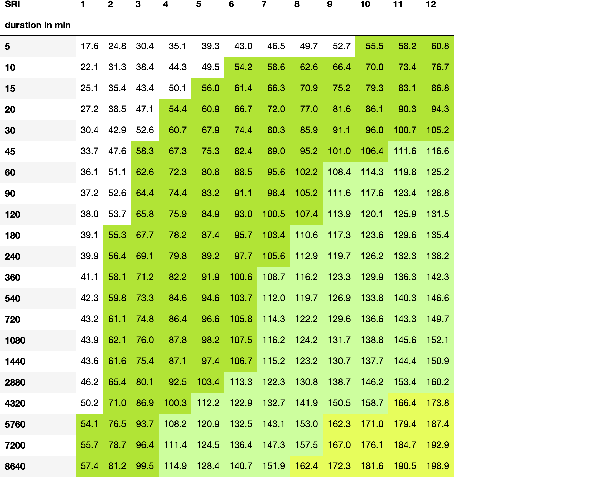
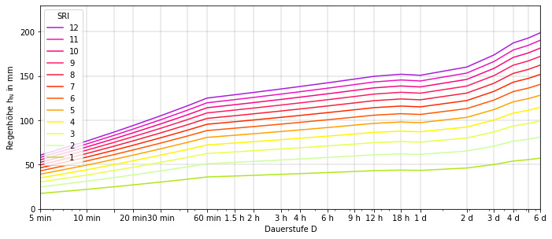
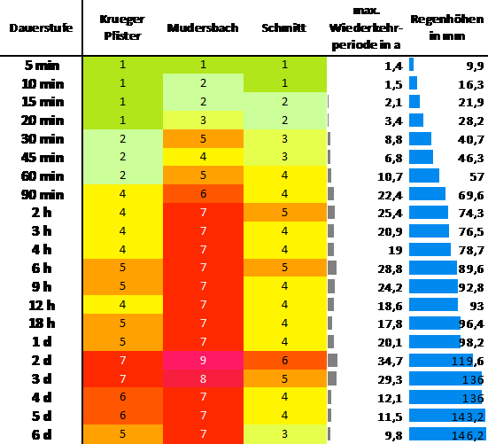

# heavy_rainfall_index

Generation of a heavy rainfall index (Ger.: Starkregenindex) based on long term precipitation measurement data

Based on the IntensityDurationFrequencyAnalysis [1], the HeavyRainIndexAnalysis enables the creation of location-dependent heavy rain indices according to the methods of Schmitt [2], Mudersbach [3] and also those of Krüger and Pfister [4]. These most of these methods are based on the publication of Grisa [5]. 

Furthermore, the possibility of creating heavy rain index curves according to the Krüger and Pfister method was included and implemented for the other two methods. Thus, heavy rainfall index curves can be compared with each other. Furthermore, it is possible to assign individual rain events to a heavy rain index using existing rain data.

Required python packages

- `matplotlib`
- `numpy `
- `pandas`
- `IntensityDurationFrequencyAnalyse`

Heavy rainfall index-matrix is created with regard to the individual procedures for SRI generation.

An auxiliary table must be generated for the creation of the heavy rain index-curves. Here, the rainfall heights are shown depending on the duration and the heavy rain index.

Using heavy rainfall index curves, the necessary rainfall heights can be read off depending on the respective index.

Specific rain event with allocation of heavy rain indices depending on the method and duration.

## Bibliography:

[1]: 
IntensityDurationFrequencyAnalyse <https://pypi.org/project/idf-analysis/>

[2]: 
Schmitt, Theo & Krüger, Marc & Pfister, Angela & Becker, Michael & Mudersbach, Christoph & Fuchs, Lothar & Hoppe, Holger & Lakes, Inga. (2018). Einheitliches Konzept zur Bewertung von Starkregenereignissen mittels Starkregenindex. 65. <http://doi.org/113-120.10.3242/kae2018.02.002>.

[3]: 
Mudersbach, Christoph. (2016). Ableitung eines Starkregenindex in Abhängigkeit von Jährlichkeit und Regendauer. <http://doi.org/10.13140/RG.2.1.1147.8006/1>. 

[4]: 
Krüger, Marc & Pfister, Angela. (2016). Anwendung von Starkregenindex-Verfahren zur Unterstützung der Risikokommunikation in der Emscher-Lippe-Region. 9. 412-419. <http://doi.org/10.3243/kwe2016.07.004>.

[5]: 
Thomas M. Grisa (2017). Communicating the Severity of Rain Storms to the Public Using a Dimensionless Scale Instead of Probabilities or Recurrence Intervals. <http://doi.org/10.1061/9780784480601.047>